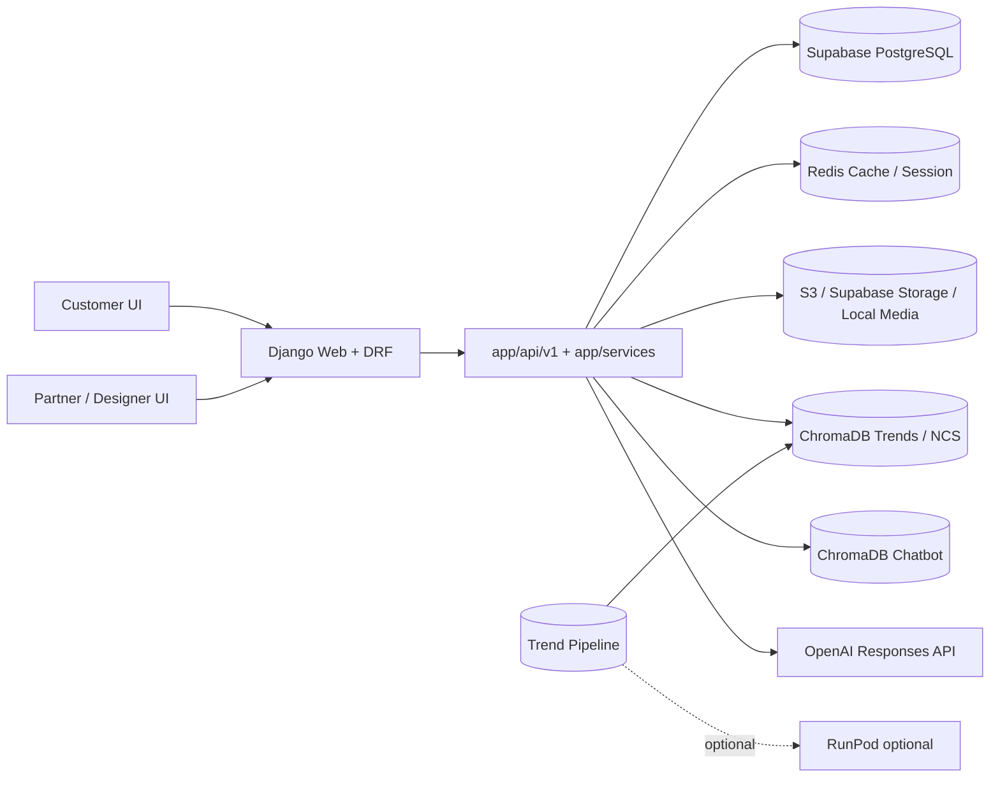

# MirrAI

MirrAI는 Django 기반 헤어스타일 추천/상담 플랫폼이다.  
고객 분석 플로우, 파트너 대시보드, 트렌드 리포트, 스타일 리포트, 상담 메모, 그리고 용도가 분리된 두 개의 챗봇을 함께 운영한다.

## 핵심 기능

- 고객 플로우
  - 설문, 촬영/업로드, 분석, 추천 결과 확인
  - 추천 결과 재생성(`regenerate simulation`) 지원
  - 상담 요청 및 이력 확인
- 파트너/디자이너 플로우
  - 고객 목록/상세/히스토리 조회
  - 디자이너 배정
  - 디자이너 진단 카드 작성
  - 상담 메모 작성/종료 처리
  - 주간 트렌드 리포트, 스타일 리포트 조회
- AI/트렌드
  - 최신 헤어 트렌드 수집 및 ChromaDB 벡터화
  - NCS PDF 기반 디자이너 참고 자료 운영
  - OpenAI 기반 챗봇 응답
  - AI 헬스 확인 API 제공

## 챗봇 구성

현재 챗봇은 두 개로 분리되어 있다.

1. 고객 트렌드 챗봇
   - 엔드포인트: `/api/v1/analysis/trend/chatbot/ask/`
   - 목적: 고객에게 최신 스타일 트렌드, 분위기, 관리 난이도 설명
   - 데이터 소스: 최신 트렌드 피드 + 고객용 persona

2. 관리자/디자이너 챗봇
   - 엔드포인트: `/api/v1/admin/chatbot/ask/`
   - 목적: 디자이너 상담 보조, 시술/상담 가이드, 참고 이미지 제안
   - 데이터 소스: `chromadb_chatbot`, NCS 시각 참고자료, 디자이너용 persona

추가로 관리자 화면에서 AI 상태를 확인할 수 있다.

- AI health: `/api/v1/admin/ai-health/`

두 챗봇 모두 다음 성격을 가진다.

- OpenAI Responses API 기반
- prompt injection / role override 방어
- 세션 정체성 고정
- conversation history 반영
- fallback model 지원

## 시스템 개요



## 주요 경로

- URL 진입점: `mirrai_project/urls.py`, `app/urls_front.py`
- 고객 화면: `templates/customer/*`
- 파트너 화면: `templates/admin/*`
- 고객 API: `app/api/v1/django_views.py`
- 파트너 API: `app/api/v1/admin_views.py`
- 챗봇 서비스: `app/services/chatbot/*`
- 트렌드 파이프라인: `app/trend_pipeline/*`

## 데이터 저장소

- 운영 DB: Supabase PostgreSQL
- 캐시/세션: Redis
- 업로드/파일 저장: S3 또는 Supabase Storage, 실패 시 local media fallback
- RAG 저장소
  - `data/rag/stores/chromadb_trends`
  - `data/rag/stores/chromadb_ncs`
  - `data/rag/stores/chromadb_chatbot`

주의:

- Chroma 저장소는 `chroma.sqlite3`만 있으면 안 된다.
- 같은 디렉터리 아래 `*.bin`, `header.bin`, `link_lists.bin`까지 함께 배포되어야 한다.

## 로컬 실행

1. 환경 변수 파일 준비

```powershell
Copy-Item .env.example .env
```

2. 의존성 설치

```bash
pip install -r requirements.txt
python -m playwright install chromium
```

3. 마이그레이션 및 실행

```bash
python manage.py migrate
python manage.py runserver
```

## 환경 변수 요약

배포 기준으로 가장 중요한 값은 아래다.

### 필수

- `SECRET_KEY`
- `DEBUG=False`
- `ALLOWED_HOSTS`
- `SUPABASE_DB_URL`

### 챗봇 사용 시 권장

- `MIRRAI_MODEL_CHATBOT_API_KEY` 또는 `OPENAI_API_KEY`
- `MIRRAI_MODEL_CHATBOT_OPENAI_MODEL`
- `MIRRAI_MODEL_CHATBOT_FALLBACK_OPENAI_MODEL`

### Redis 사용 시 권장

- `REDIS_URL`
- `REDIS_USE_FOR_SESSIONS=True`

### NCS PDF / EFS 사용 시

- `NCS_PDF_SYNC_SOURCE_DIR=/mnt/mirrai-ncs-pdfs`
- `NCS_PDF_SYNC_STRICT=1`
- `NCS_EFS_FILE_SYSTEM_ID`
- `NCS_EFS_REGION`
- `NCS_EFS_ACCESS_POINT_ID` (선택)
- `NCS_EFS_MOUNT_TIMEOUT_SECONDS`

상세 체크리스트는 [`docs/elastic_beanstalk_deploy_checklist.md`](docs/elastic_beanstalk_deploy_checklist.md) 참고.

## 배포

현재 GitHub Actions 배포 흐름은 아래다.

1. Docker 이미지 빌드
2. ECR push
3. `Dockerrun.aws.json`에 이미지 URI 주입
4. `Dockerrun.aws.json` + `.platform/**`를 zip으로 묶어 Elastic Beanstalk에 배포

즉, 실제 EB 애플리케이션 버전에 올라가는 파일은 최소 기준으로 아래다.

- `Dockerrun.aws.json`
- `.platform/bin/mount_ncs_efs.sh`
- `.platform/hooks/predeploy/10_mount_ncs_efs.sh`
- `.platform/confighooks/predeploy/10_mount_ncs_efs.sh`

## 다른 배포 repo에 업로드할 파일

분리된 배포 repo를 어떻게 쓸지에 따라 올릴 파일이 달라진다.

### 1. 별도 repo가 이미지를 직접 빌드하는 경우

아래 파일/디렉터리를 같이 올려야 한다.

- `app/**`
- `mirrai_project/**`
- `templates/**`
- `static/**`
- `data/**`
- `Dockerfile`
- `.dockerignore`
- `docker-entrypoint.sh`
- `manage.py`
- `requirements.txt`
- `requirements-deploy.txt`
- `requirements-trends.txt`
- `Dockerrun.aws.json`
- `.platform/**`
- `.github/workflows/deploy.yml` 또는 해당 repo 전용 배포 workflow

이 목록은 현재 repo의 실제 배포 workflow path filter와 맞춘 것이다.

### 2. 별도 repo가 "이미 빌드된 ECR 이미지"만 배포하는 경우

최소 업로드 파일:

- `Dockerrun.aws.json`
- `.platform/**`

단, 이 경우 `Dockerrun.aws.json`의 `Image.Name`은 실제 ECR 이미지 URI로 바꿔서 올려야 한다.

## ELB/EB 헬스 체크 메모

- 컨테이너는 `8000` 포트에서 gunicorn으로 뜬다.
- EB는 `Dockerrun.aws.json`에서 host `80` -> container `8000`으로 연결한다.
- health check 대응은 `/` 와 `/health/`에서 처리한다.
- startup 체인은 `collectstatic -> verify_static_manifest -> migrate -> gunicorn` 이다.

헬스가 깨질 때는 아래를 먼저 본다.

- `SUPABASE_DB_URL` 누락 여부
- startup migration 실패 여부
- Redis 접속 지연 여부
- EFS mount 경고 여부
- EB 이벤트 / 컨테이너 로그

## 관련 문서

- 시스템 구조: [`docs/system_architecture/README.md`](docs/system_architecture/README.md)
- 프롬프트 인젝션 방어: [`docs/prompt_injection_defense/README.md`](docs/prompt_injection_defense/README.md)
- 데모 시나리오: [`docs/demo_video_scenario.md`](docs/demo_video_scenario.md)
- EB 배포 체크리스트: [`docs/elastic_beanstalk_deploy_checklist.md`](docs/elastic_beanstalk_deploy_checklist.md)
