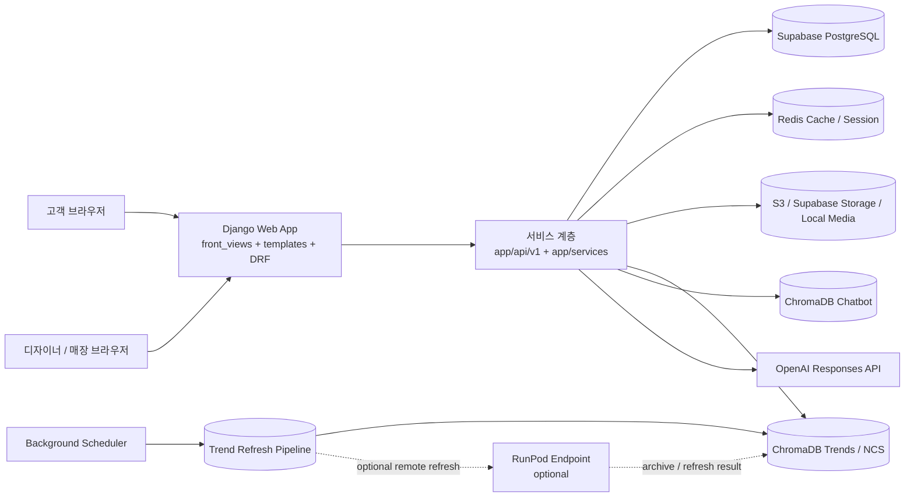

# MirrAI

MirrAI는 고객 플로우, 파트너/디자이너 도구, 최신 트렌드 피드, 디자이너 지원 챗봇을 제공하는 Django 기반 헤어스타일 추천 플랫폼입니다.

## 런타임 개요

- 고객 플로우: 설문, 촬영, 얼굴 분석, 추천 결과 확인, 상담 요청
- 파트너 플로우: 대시보드, 고객 조회, 디자이너 배정, 상담 관리
- 트렌드 피드: 트렌드 RAG 저장소를 기반으로 최신 헤어 트렌드 카드 제공
- 디자이너 챗봇: 로컬 Chroma 저장소를 이용한 디자이너 지원 검색형 챗봇

## 문서 가이드

- 시연 시나리오: [`docs/demo_video_scenario.md`](docs/demo_video_scenario.md)
- 시스템 아키텍처 상세: [`docs/system_architecture/README.md`](docs/system_architecture/README.md)
- 프롬프트 인젝션 방어 상세: [`docs/prompt_injection_defense/README.md`](docs/prompt_injection_defense/README.md)

## 시스템 아키텍처



- 웹 진입점은 `mirrai_project/urls.py`, `app/urls_front.py`에서 관리합니다.
- 고객/디자이너/매장 화면은 Django 템플릿 기반으로 렌더링되고, 세부 데이터는 `app/api/v1`과 `app/services`에서 처리합니다.
- 운영 데이터는 Supabase PostgreSQL을 기준으로 조회하고, 대시보드/리포트/세션은 Redis 캐시를 사용할 수 있습니다.
- 트렌드 피드와 챗봇은 각각 별도 Chroma 저장소를 사용하고, 챗봇 응답은 OpenAI Responses API를 우선 사용합니다.
- 상세 구조와 요청 흐름은 [`docs/system_architecture/README.md`](docs/system_architecture/README.md)에서 확인할 수 있습니다.
- 챗봇 프롬프트 인젝션 방어 흐름은 [`docs/prompt_injection_defense/README.md`](docs/prompt_injection_defense/README.md)에서 확인할 수 있습니다.

## 데이터 구조

프로젝트는 현재 두 계열의 테이블을 함께 사용합니다.

- 런타임 Django 테이블: `clients`, `designers`, `styles`, `surveys`, `capture_records`
- 레거시 브리지 테이블: `client`, `designer`, `hairstyle`, `client_survey`, `client_analysis`, `client_result`

레거시 브리지 테이블이 존재하는 경우, 일부 파트너/추천 경로는 `app/services/model_team_bridge.py`를 통해 해당 데이터를 우선 조회합니다.

추가로, 이번 파트너센터 트렌드 리포트 경로도 같은 브리지를 따라 동작하도록 정리되어 실제 운영 DB가 Supabase(PostgreSQL)일 때도 동일한 기준으로 조회됩니다.

## RAG 저장소

저장소에는 운영에 필요한 Chroma 저장소만 포함합니다.

- `data/rag/stores/chromadb_trends`
- `data/rag/stores/chromadb_ncs`
- `data/rag/stores/chromadb_chatbot`

배포 대상에서 제외되는 저장소:

- `data/rag/stores/chromadb_styles`

주의 사항:
Chroma 영속 저장소는 `chroma.sqlite3`뿐 아니라 `*.bin`, `header.bin`, `link_lists.bin` 같은 인덱스 파일도 함께 있어야 정상 동작합니다. 배포 시에는 같은 디렉터리 단위로 유지해야 합니다.

## 로컬 실행

1. `.env.example`을 복사해 `.env`를 만듭니다.

```powershell
Copy-Item .env.example .env
```

2. 의존성을 설치합니다.

```bash
pip install -r requirements.txt
python -m playwright install chromium
```

3. 마이그레이션 후 서버를 실행합니다.

```bash
python manage.py migrate
python manage.py runserver
```

## Supabase 연결 확인

운영 DB를 Supabase로 사용할 때는 아래 항목을 먼저 확인하세요.

- `DATABASE_URL` 또는 `SUPABASE_DB_URL`이 Supabase PostgreSQL 주소를 가리키는지 확인
- `SUPABASE_USE_REMOTE_DB=True` 또는 운영 환경에서 PostgreSQL 엔진이 선택되는지 확인
- 파트너센터 트렌드 리포트는 화면의 `No data` 여부만 보지 말고 실제 서비스 함수 기준으로 확인

확인 예시:

```bash
python manage.py shell -c "from django.conf import settings; print(settings.DATABASES['default']['HOST'])"
```

## Redis 캐시 및 세션

파트너 대시보드, 고객 목록, 트렌드 리포트는 Redis 캐시를 사용할 수 있습니다. `REDIS_URL`이 설정되면 Django 캐시가 Redis를 사용하고, `REDIS_USE_FOR_SESSIONS=True`면 세션도 `cached_db` 기반으로 전환됩니다.

로컬 Redis 실행:

```bash
docker compose up -d redis
```

예시 환경 변수:

```text
REDIS_URL=redis://127.0.0.1:6379/1
REDIS_USE_FOR_SESSIONS=True
REDIS_KEY_PREFIX=mirrai
CACHE_DEFAULT_TIMEOUT=300
PARTNER_REPORT_CACHE_SECONDS=90
PARTNER_LOOKUP_CACHE_SECONDS=45
```

운영형 Redis(TLS) 예시:

```text
REDIS_URL=rediss://:<password>@<redis-endpoint>:6379/0
REDIS_USE_FOR_SESSIONS=True
```

## 파트너센터 리포트 동작 기준

현재 파트너센터 트렌드 리포트는 아래 기준으로 집계됩니다.

- 매장 대시보드: 매장 전체 고객, 상담, 분석 데이터를 기준으로 집계
- 디자이너 대시보드: 해당 디자이너에게 배정된 고객 데이터만 기준으로 집계

관련 구현 파일:

- `app/services/model_team_bridge.py`
- `app/api/v1/admin_services.py`
- `app/api/v1/admin_views.py`
- `templates/admin/index.html`

## 트렌드 데이터 갱신

배포 전 최신 트렌드 데이터로 운영용 Chroma 저장소를 갱신하려면 다음 명령을 사용합니다.

```bash
python manage.py refresh_trends --mode local --steps crawl,refine,llm_refine,vectorize
```

이미 정제된 데이터로 Chroma 컬렉션만 다시 만들고 싶다면 다음 명령을 사용합니다.

```bash
python manage.py refresh_trends --mode local --steps vectorize
```

## 스케줄러

주요 환경 변수:

- `ENABLE_TREND_SCHEDULER`
- `TREND_SCHEDULER_TIMEZONE`
- `TREND_SCHEDULER_WEEKLY_DAY`
- `TREND_SCHEDULER_WEEKLY_HOUR`
- `TREND_SCHEDULER_WEEKLY_MINUTE`
- `TREND_SCHEDULER_STEPS`

현재 기본 스텝:

```text
crawl,refine,llm_refine,vectorize,rebuild_ncs
```

현재 코드 기준으로 `ENABLE_TREND_SCHEDULER=True`를 주면 Django `runserver`와 Gunicorn 웹 런타임 모두에서 스케줄러 자동 시작이 가능합니다.

수동 실행:

```bash
python manage.py run_trend_scheduler
```

## 배포 메모

Elastic Beanstalk는 `Dockerfile`과 `.github/workflows/deploy.yml`을 기준으로 이미지를 빌드합니다.

배포 시 기대 동작:

- 빌드 컨텍스트에서 테스트와 비운영 데이터는 제외
- `chromadb_trends`, `chromadb_ncs`, `chromadb_chatbot`만 이미지에 포함
- `chromadb_styles`는 Docker 빌드 컨텍스트에서 제외
- `REDIS_URL`이 설정되면 파트너 대시보드와 리포트 응답은 Redis 캐시를 사용
- `REDIS_URL`이 설정되고 `REDIS_USE_FOR_SESSIONS=True`면 세션 저장 방식은 `cached_db`로 전환

Elastic Beanstalk 권장 환경 변수:

```text
REDIS_URL=rediss://:<password>@<redis-endpoint>:6379/0
REDIS_USE_FOR_SESSIONS=True
REDIS_KEY_PREFIX=mirrai
CACHE_DEFAULT_TIMEOUT=300
PARTNER_REPORT_CACHE_SECONDS=90
PARTNER_LOOKUP_CACHE_SECONDS=45
```

디자이너 챗봇 참고이미지 저장 기준:

- PDF 원본은 EFS에서 읽습니다.
- PDF에서 추출한 참고이미지는 `S3_BUCKET_NAME` 이 설정되어 있으면 S3에 먼저 저장합니다.
- S3 저장이 불가능하면 Supabase Storage로 fallback 하고, 그것도 실패하면 마지막으로 로컬 media 경로를 사용합니다.
- S3를 쓰지 않는 환경이면 `S3_BUCKET_NAME` 은 비워 두세요.

NCS PDF 운영 동기화:

- 디자이너 챗봇 PDF 원본은 런타임 기준 `data/rag/sources/ncs` 경로를 직접 읽습니다.
- 배포 이미지에 PDF를 포함하지 않을 경우, 컨테이너가 접근 가능한 별도 디렉터리(예: EFS, 호스트 마운트, 배포 후 동기화 폴더)에 PDF를 먼저 넣어둡니다.
- Elastic Beanstalk 환경 변수에 아래 값을 추가하면 컨테이너 시작 시 해당 폴더의 `*.pdf` 파일을 `/app/data/rag/sources/ncs/` 로 복사합니다.
- `main` 브랜치 배포는 애플리케이션 이미지와 설정만 배포하며, 챗봇용 PDF 파일 자체를 EFS로 업로드하지는 않습니다.
- 즉 배포 전에 EFS의 `/mnt/mirrai-ncs-pdfs` 같은 소스 경로에 PDF를 미리 올려 둬야 합니다.

```text
NCS_PDF_SYNC_SOURCE_DIR=/mnt/mirrai-ncs-pdfs
NCS_PDF_SYNC_OVERWRITE=0
NCS_PDF_SYNC_STRICT=1
```

- `NCS_PDF_SYNC_SOURCE_DIR`: 컨테이너 안에서 보이는 외부 PDF 폴더 경로
- `NCS_PDF_SYNC_OVERWRITE=1`: 같은 이름 PDF가 이미 있어도 덮어씀
- `NCS_PDF_SYNC_STRICT=1`: 소스 폴더가 없거나 PDF가 없으면 컨테이너 시작을 실패시킴
- 수동 실행이 필요하면 아래 명령으로 같은 동기화를 즉시 수행할 수 있습니다.

```bash
python manage.py sync_ncs_source_pdfs --source-dir /mnt/mirrai-ncs-pdfs --strict
```

Elastic Beanstalk에서 `/mnt/mirrai-ncs-pdfs` 를 실제로 보이게 하려면:

- 이 저장소의 `.platform/hooks/predeploy/10_mount_ncs_efs.sh` 와 `.platform/confighooks/predeploy/10_mount_ncs_efs.sh` 가 배포/환경설정 변경 시 호스트에 EFS를 마운트합니다.
- `Dockerrun.aws.json` 의 `Volumes` 가 호스트의 `/mnt/mirrai-ncs-pdfs` 를 컨테이너의 같은 경로로 전달합니다.
- 컨테이너 시작 시 `docker-entrypoint.sh` 가 `NCS_PDF_SYNC_SOURCE_DIR` 의 PDF를 `/app/data/rag/sources/ncs/` 로 복사합니다.

Elastic Beanstalk 환경 변수에 아래 값을 추가하세요:

```text
NCS_PDF_SYNC_SOURCE_DIR=/mnt/mirrai-ncs-pdfs
NCS_PDF_SYNC_OVERWRITE=0
NCS_PDF_SYNC_STRICT=1
NCS_EFS_FILE_SYSTEM_ID=fs-xxxxxxxx
NCS_EFS_REGION=ap-northeast-2
NCS_EFS_ACCESS_POINT_ID=fsap-xxxxxxxx   # 선택
NCS_EFS_MOUNT_POINT=/mnt/mirrai-ncs-pdfs
```

운영 설정 순서:

- EFS 파일 시스템을 만들고, Elastic Beanstalk 인스턴스와 같은 VPC/서브넷 대역에 마운트 타깃을 생성합니다.
- EFS 보안 그룹 인바운드에 NFS `2049` 를 열고, 소스로 Elastic Beanstalk EC2 인스턴스 보안 그룹을 허용합니다.
- 위 환경 변수를 Elastic Beanstalk 환경 속성에 등록합니다.
- 필요하면 PDF 원본을 EFS 루트 또는 Access Point 경로 아래에 먼저 업로드합니다.
- 새 버전을 배포하거나 환경 속성을 저장하면, 호스트에서 EFS가 `/mnt/mirrai-ncs-pdfs` 로 마운트되고 컨테이너에서도 같은 경로가 보입니다.
- 앱 시작 시 PDF가 `/app/data/rag/sources/ncs/` 로 동기화됩니다.

주의:

- `NCS_EFS_ACCESS_POINT_ID` 를 쓰면 EFS Access Point 기준 경로/권한으로 마운트됩니다.
- `NCS_EFS_FILE_SYSTEM_ID` 가 비어 있으면 훅은 아무 것도 하지 않고 넘어갑니다.
- 현재 GitHub Actions 배포 패키지는 `.platform` 디렉터리까지 함께 압축하도록 수정되어야 훅이 배포 환경에 포함됩니다.

GitHub Actions 배포 트리거:

- 배포는 `main` 브랜치에 대한 `push`에서만 실행
- `develop` 병합만으로는 자동 배포되지 않음
- `main` 병합 시에도 아래 path filter에 걸린 파일이 포함될 때만 배포
  `app/**`, `mirrai_project/**`, `static/**`, `templates/**`, `data/**`, `Dockerfile`, `.dockerignore`, `docker-entrypoint.sh`, `manage.py`, `requirements.txt`, `requirements-deploy.txt`, `requirements-trends.txt`, `Dockerrun.aws.json`, `.platform/**`, `.github/workflows/deploy.yml`
- `README.md` 또는 `.gitignore`만 변경된 경우에는 배포가 트리거되지 않음

트렌드 데이터가 바뀌었다면 갱신된 `chromadb_trends` 저장소까지 함께 커밋한 뒤 `main`에 반영해 주세요.

## 자주 쓰는 명령어

```bash
python manage.py check
python manage.py test
python manage.py refresh_trends --mode local --steps vectorize
python manage.py run_trend_scheduler
```

## 테스트

- 테스트 코드는 개발 및 회귀 검증을 위해 `app/tests/`에 유지합니다.
- `.dockerignore`는 테스트 디렉터리를 운영 빌드 컨텍스트에서 제외합니다.
- 일부 테스트는 현재 레포의 기존 모델 import 상태에 영향을 받을 수 있으므로, 리포트와 세션 검증은 `manage.py shell` 기반 확인을 함께 사용하는 것이 안전합니다.

## 최근 반영 사항

이번 변경에서는 기존 프로젝트 소개나 전체 개요는 유지하고, 최근에 수정한 운영/개발 포인트만 추가로 정리했습니다.

- 캡처 업로드 후 백그라운드 분석 스레드에 `processed_bytes`를 항상 전달하도록 정리했습니다.
- 분석/추천 파이프라인에서 저장된 이미지 참조를 다시 읽어 byte payload로 재사용할 수 있도록 보완했습니다.
- 브라우저 첫 방문 시 불필요한 세션 저장을 막고, stale cached session 이 있으면 먼저 flush 하도록 세션 정리 로직을 보강했습니다.
- `DEBUG=True` 환경에서는 세션 엔진이 자동으로 `cached_db`로 바뀌지 않도록 조정했습니다.
- 최신 트렌드 피드에서 Chroma row 와 기사 메타데이터가 섞여 `title / summary / article_url`이 어긋나던 문제를 수정했습니다.
- 로컬 `chromadb_trends` 스토어가 호환되지 않는 상태일 때 자동으로 리셋 후 재빌드하도록 안전장치를 추가했습니다.
- 트렌드/NCS Chroma 저장소를 재빌드했고, 최신 번역 캐시와 로컬 Chroma 아티팩트도 함께 갱신했습니다.
- Django migration state 와 현재 런타임 모델 구성이 어긋나던 부분을 state-only migration 으로 정리했습니다.

관련 명령어:

```bash
python manage.py migrate mirrai_app 0016_sync_state_to_current_models
python manage.py refresh_trends --mode local --steps vectorize,rebuild_ncs
python manage.py makemigrations --check --dry-run --noinput
```

이번에 추가/보강된 핵심 파일:

- `app/migrations/0016_sync_state_to_current_models.py`
- `app/trend_pipeline/latest_feed.py`
- `app/trend_pipeline/vectorize_chromadb.py`
- `app/tests/test_latest_feed.py`
- `app/tests/test_trend_refresh_service.py`
