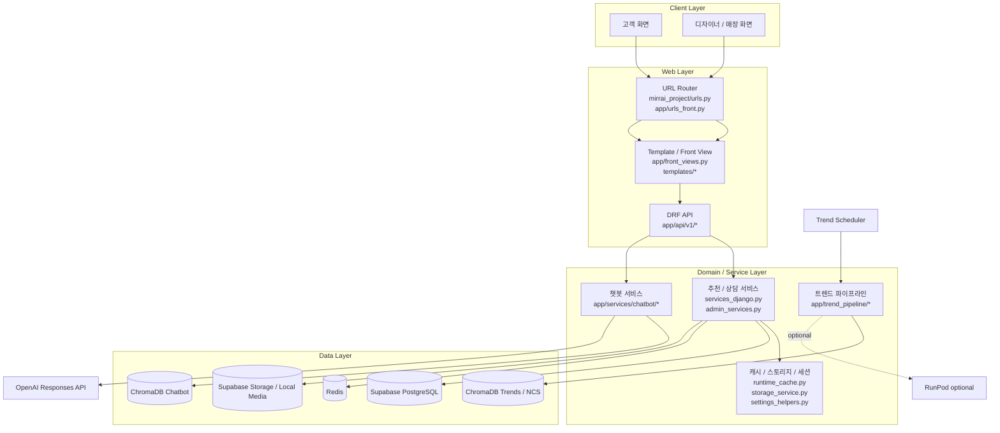
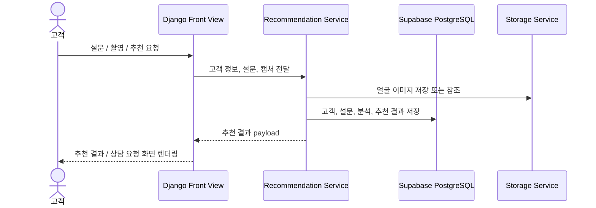
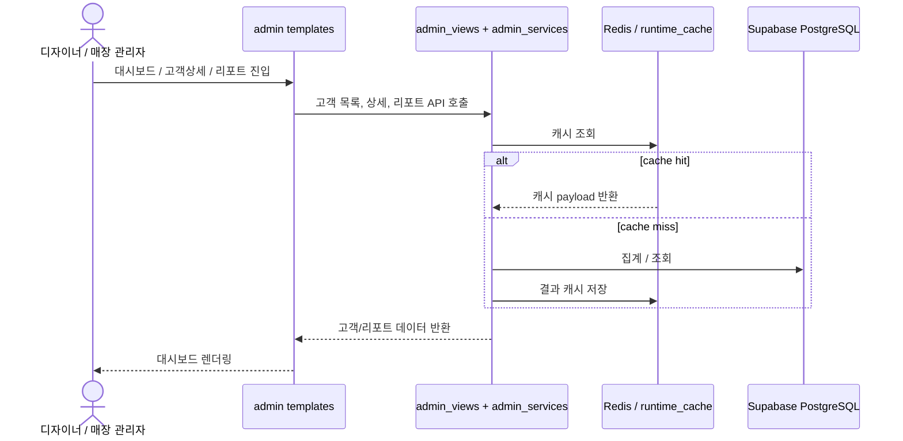
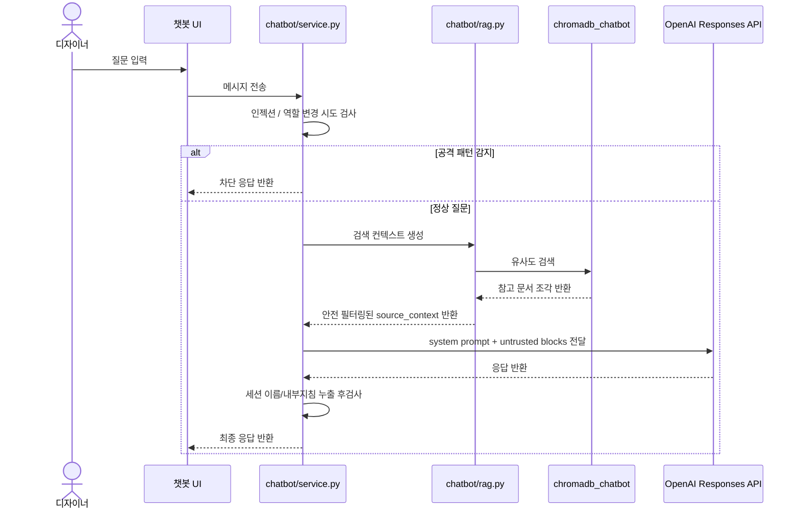
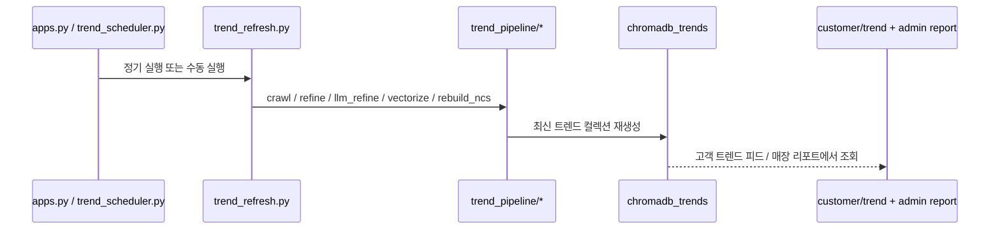

# MirrAI 시스템 아키텍처

## 개요

MirrAI는 Django 서버 렌더링 UI와 DRF API, Supabase PostgreSQL, Redis, ChromaDB, OpenAI를 조합한 구조다.  
고객 추천 흐름, 디자이너 상담 보조, 매장 리포트, 트렌드 갱신 파이프라인이 한 저장소 안에서 함께 동작한다.

## 상위 구성도

## 핵심 요청 흐름

### 1. 고객 추천 흐름

- 주요 파일
  - `app/front_views.py`
  - `app/api/v1/services_django.py`
  - `app/models_django.py`
  - `app/services/storage_service.py`

### 2. 디자이너 / 매장 운영 흐름

- 주요 파일
  - `app/api/v1/admin_views.py`
  - `app/api/v1/admin_services.py`
  - `app/services/runtime_cache.py`
  - `templates/admin/index.html`
  - `templates/admin/customer_detail.html`

### 3. 디자이너 챗봇 흐름

- 주요 파일
  - `app/services/chatbot/service.py`
  - `app/services/chatbot/rag.py`
  - `templates/components/chatbot.html`
  - `app/tests/test_chatbot_service.py`

### 4. 최신 트렌드 갱신 흐름

- 주요 파일
  - `app/apps.py`
  - `app/services/trend_scheduler.py`
  - `app/services/trend_refresh.py`
  - `app/trend_pipeline/vectorize_chromadb.py`
  - `templates/customer/trend.html`

## 저장소와 역할

| 저장소 | 역할 | 대표 경로 |
| --- | --- | --- |
| Supabase PostgreSQL | 고객, 디자이너, 설문, 추천, 상담, 리포트 집계 | `mirrai_project/settings.py`, `app/models_django.py` |
| Redis | 세션, 파트너 리포트 캐시, 목록 캐시 | `mirrai_project/settings.py`, `app/services/runtime_cache.py` |
| Supabase Storage / Local Media | 캡처 이미지 및 미디어 참조 | `app/services/storage_service.py` |
| ChromaDB Trends / NCS | 최신 트렌드, 리포트, 일부 추천 보조 | `data/rag/stores/chromadb_trends`, `data/rag/stores/chromadb_ncs` |
| ChromaDB Chatbot | 디자이너 챗봇 검색 인덱스 | `data/rag/stores/chromadb_chatbot` |

## 함께 볼 문서

- 시연 시나리오: [`../demo_video_scenario.md`](../demo_video_scenario.md)
- 프롬프트 인젝션 방어: [`../prompt_injection_defense/README.md`](../prompt_injection_defense/README.md)
